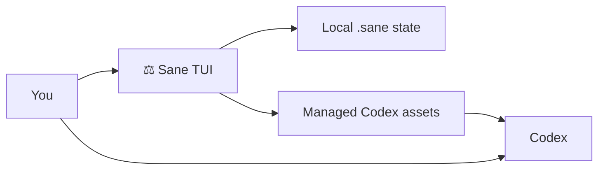

# ⚖️ Sane

Sane is a Codex-native QoL framework for Codex users who want better agent behavior without adopting a whole new ritual.

> [!WARNING]
> `Sane` is early WIP.
> Core ideas are stable. Product surface is still evolving.

**Jump to:** [Who It’s For](#who-its-for) · [What It Does](#what-it-does) · [How It Works](#how-it-works) · [Quick Start](#quick-start)

## Who It's For

`Sane` is for people who:

- use Codex and want a better default experience
- want something usable whether they are lightly customized or deeply opinionated
- want plain-language prompting to stay the default
- like rigor when it matters, but hate framework ceremony
- care about speed, token use, and long-session quality
- want setup, profiles, and managed assets to feel cleaner and safer

## What It Does

`Sane` does not replace Codex.

It improves the operational layer around Codex:

- setup
- defaults
- model-role configuration
- managed Codex assets
- local-first state
- repair and inspection flows

For the user, the goal is simple:

1. open `Sane`
2. configure your preferences
3. keep using Codex normally
4. let `Sane` manage the infrastructure around that workflow

## What You Get

| Area | What the user gets |
| --- | --- |
| Prompting | Plain-language first workflow |
| Setup | One place to configure model roles, packs, and profiles |
| Codex integration | Managed user-level skills, hooks, agents, and overlays |
| Safety | Preview, backup, restore, uninstall, and doctor flows |
| Long sessions | Local-first state and adaptive-policy groundwork |

## How It Works



`Sane` is a thin control plane:

- You still prompt Codex directly
- `Sane` manages local state and selected Codex-native assets
- repository mutation remains optional
- While commands may exist, the product is not command-first

## Current Direction

Right now `Sane` is focused on a dedicated configuration TUI, Codex-native asset management, dynamic model-role groundwork, and local-first privacy, status, and repair flows.

## Quick Start

```bash
cargo run -p sane
```

That opens the TUI.

## Repo Map

- [`docs/specs/2026-04-19-sane-design.md`](./docs/specs/2026-04-19-sane-design.md) — design direction
- [`docs/decisions/2026-04-19-sane-decision-log.md`](./docs/decisions/2026-04-19-sane-decision-log.md) — locked decisions
- [`TODO.md`](./TODO.md) — handoff and next work

## Workspace

- [`crates/sane-tui/README.md`](./crates/sane-tui/README.md)
- [`crates/sane-core/README.md`](./crates/sane-core/README.md)
- [`crates/sane-config/README.md`](./crates/sane-config/README.md)
- [`crates/sane-platform/README.md`](./crates/sane-platform/README.md)
- [`crates/sane-state/README.md`](./crates/sane-state/README.md)
- [`crates/sane-policy/README.md`](./crates/sane-policy/README.md)

## License

Licensed under either Apache-2.0 or MIT, at your option.
