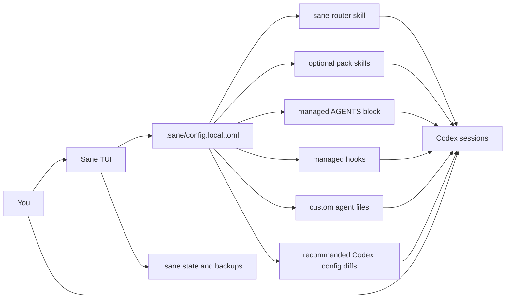

<h1 align="center">⚖️ Sane</h1>

<p align="center">
  <strong>Make Codex feel better without changing how you work.</strong>
</p>

<p align="center">
  A Codex-native quality-of-life layer for setup, defaults, routing, repair, and long-session hygiene.
</p>

<p align="center">
  
  
  
  
</p>

<p align="center">
  <a href="#why-sane">Why Sane</a> •
  <a href="#what-sane-is">What Sane Is</a> •
  <a href="#under-the-hood">Under the Hood</a> •
  <a href="#who-its-for">Who It's For</a> •
  <a href="#how-it-feels">How It Feels</a> •
  <a href="#what-it-manages">What It Manages</a> •
  <a href="#getting-started">Getting Started</a> •
  <a href="#community">Community</a>
</p>

> [!WARNING]
> `Sane` is still pre-release.
> It is being built in public and actively dogfooded, but the surface area is not stable yet.

> [!NOTE]
> `Sane` is being built for [Buildstory Hackathon #2](https://www.buildstory.com/projects/sane), where the goal is to ship a real open-source Codex QoL tool in public during the event.

## Why Sane

Codex is already powerful. The friction is everything around it:

- repeating the same model, reasoning, and hook setup across machines and repos
- changing Codex config by hand with no clean preview or backup
- letting long sessions get messy with no clear state, summary, or repair flow
- adopting frameworks that replace plain-language work with commands and ritual

`Sane` exists to fix that operational layer without becoming another thing you have to "use correctly."

## What Sane Is

`Sane` is a local-first Codex QoL layer.

It helps you:

- keep using plain-language prompting
- manage Codex-native assets safely
- tune model and reasoning defaults
- keep long sessions healthier
- inspect, repair, back up, restore, and uninstall what it manages

The TUI is only the front door.
The actual product is the Codex-native skills, hooks, agent files, config profiles, and local state that `Sane` installs and manages.

`Sane` is not a replacement chat interface and not a wrapper you have to prompt through every day.

Here, "Codex-native assets" means things like:

- skills
- hooks
- custom agents
- managed overlays such as `AGENTS.md` guidance blocks

## Under the Hood

`Sane` works by generating and maintaining native Codex surfaces from one local source of truth.

### What it actually installs and manages

| Surface | What Sane manages | Why it exists |
| --- | --- | --- |
| Local config | `.sane/config.local.toml` | Stores model-role defaults, pack toggles, and privacy choices |
| Router skill | `~/.agents/skills/sane-router/SKILL.md` | Gives Codex a plain-language-first Sane workflow skill |
| Pack skills | `sane-caveman`, `sane-cavemem`, `sane-rtk`, `sane-frontend-craft` | Add optional guidance layers without forcing commands |
| Global overlay | managed block inside `~/.codex/AGENTS.md` | Adds always-on Sane guidance without taking over the whole file |
| Hooks | managed entries inside `~/.codex/hooks.json` | Adds lightweight Codex hook behavior where useful |
| Custom agents | managed files in `~/.codex/agents/` such as `sane-explorer` and `sane-reviewer` | Gives Sane bounded specialist roles it can lean on later |
| Codex config | narrow diffs to `~/.codex/config.toml` | Applies recommended core, integrations, and provider profiles safely |
| Local operational state | `.sane/state/*`, `BRIEF.md`, backups | Lets Sane inspect, repair, summarize, and roll back what it manages |

### How the moving parts fit together

1. You choose defaults in the TUI.
2. `Sane` stores those choices in `.sane/config.local.toml`.
3. `Sane` renders native Codex assets from that config:
   - router skill
   - optional pack skills
   - global guidance overlay
   - hooks
   - custom agent files
   - narrow Codex config updates
4. You keep using Codex normally.
5. Codex now has those assets available during normal sessions.
6. `Sane` uses `.sane` state and backups to keep that setup inspectable, repairable, and removable.

### How skills, packs, and agents relate

- `sane-router` is the main plain-language skill. It is the first layer that keeps command ritual optional.
- packs change the generated guidance around that layer:
  - `core` = base Sane behavior
  - `caveman` = token-efficient communication bias
  - `cavemem` = compact long-session memory bias
  - `rtk` = prefer RTK-routed shell execution when RTK policy exists
  - `frontend-craft` = stronger frontend design and anti-generic-UI bias
- hooks are small glue points, not the whole product
- custom agents are specialist files for bounded roles, not a visible multi-agent theater
- `.sane` is operational state for Sane itself, not a replacement runtime for Codex

## Who It's For

`Sane` is for anyone using Codex:

- people with zero custom setup who want a better default experience
- people with highly opinionated setups who want safer management
- solo developers who want cleaner local workflows
- teams that may later want shared Codex-native conventions

If your ideal workflow is "configure once, then just talk to Codex normally," `Sane` is aimed at you.

## How It Feels

1. Open `Sane`.
2. Pick your defaults, packs, and optional profiles.
3. Go back to Codex and work normally.
4. Let `Sane` manage the surrounding setup, safety rails, and local state.

The goal is simple: better behavior, less ceremony.

## What It Manages

| Area | What you get |
| --- | --- |
| Model defaults | Coordinator, sidecar, and verifier presets with reasoning levels |
| Codex config | Safe preview, backup, apply, and restore flows |
| Codex-native assets | Managed user skills, hooks, custom agents, and overlays |
| Local state | Project-local `.sane` state for status, summaries, events, and repair |
| Safety | `doctor`, uninstall, backups, and managed-file boundaries |
| Profiles | Lean default profile plus optional integration and provider profiles |

## What Sane Does Not Require

- repository-level `AGENTS.md`
- repo mutation
- command-first workflows
- one fixed development methodology
- a separate daily runtime outside Codex

Repository-level exports may exist later, but they are optional by design.

## How It Works



In plain English:

- you keep talking to Codex directly
- `Sane` turns one local config into native Codex behavior
- local state stays local by default
- the installer is just the control surface for those generated skills, hooks, agents, and config changes

## Getting Started

Today, `Sane` runs from source.
Packaging for Homebrew, `winget`, and other channels is planned after `v1` stabilizes.

```bash
cargo run -p sane
```

That opens the TUI.

## Project Status

Current public focus:

- a real install and configuration TUI
- safe Codex config inspection and profile application
- managed Codex-native assets
- adaptive model-role groundwork
- local-first state, privacy, and repair flows

## Community

- [Contributing guide](./CONTRIBUTING.md)
- [Code of conduct](./CODE_OF_CONDUCT.md)
- [Security policy](./SECURITY.md)
- [Support guide](./SUPPORT.md)

<details>
<summary><strong>Contributor map</strong></summary>

If you want to work on `Sane` itself:

- [`crates/sane-tui/README.md`](./crates/sane-tui/README.md) — the user-facing app surface
- [`crates/sane-core/README.md`](./crates/sane-core/README.md) — shared contracts and generated content
- [`crates/sane-config/README.md`](./crates/sane-config/README.md) — config schema and validation
- [`crates/sane-platform/README.md`](./crates/sane-platform/README.md) — path and platform discovery
- [`crates/sane-state/README.md`](./crates/sane-state/README.md) — project-local operational state
- [`crates/sane-policy/README.md`](./crates/sane-policy/README.md) — adaptive routing groundwork

Core project docs:

- [`docs/decisions/2026-04-19-sane-decision-log.md`](./docs/decisions/2026-04-19-sane-decision-log.md)
- [`docs/specs/2026-04-19-sane-design.md`](./docs/specs/2026-04-19-sane-design.md)
- [`TODO.md`](./TODO.md)

</details>

## License

Licensed under either Apache-2.0 or MIT, at your option.
