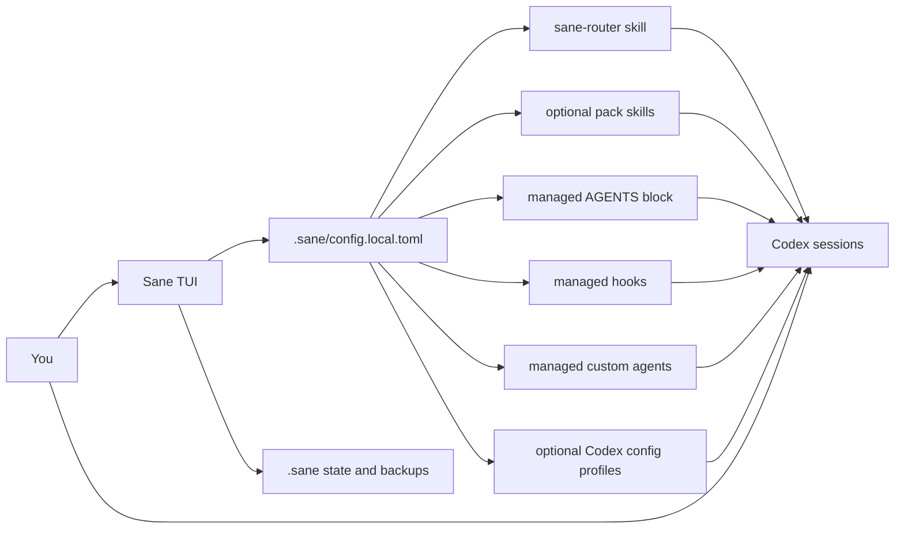

<h1 align="center">⚖️ Sane</h1>

<p align="center">
  <strong>Make Codex feel better without changing how you work.</strong>
</p>

<p align="center">
  A Codex-native quality-of-life layer for setup, defaults, skills, agent roles, profiles, and long-session hygiene.
</p>

<p align="center">
  
  
  
  
</p>

<p align="center">
  <a href="#why-sane">Why Sane</a> •
  <a href="#what-you-get">What You Get</a> •
  <a href="#whats-included">What's Included</a> •
  <a href="#how-you-use-it">How You Use It</a> •
  <a href="#what-sane-changes">What Sane Changes</a> •
  <a href="#how-it-works">How It Works</a> •
  <a href="#install">Install</a> •
  <a href="#community">Community</a>
</p>

> [!WARNING]
> `Sane` is still pre-release.
> It is being built in public and actively dogfooded, but the surface area is not stable yet.

> [!NOTE]
> `Sane` is being built for [Buildstory Hackathon #2](https://www.buildstory.com/projects/sane), where the goal is to ship a real open-source Codex QoL tool in public during the event.

## Why Sane

Codex is already strong.
What usually feels weak is everything around it:

- model defaults scattered across config
- hooks, skills, and agent files managed by hand
- no clean story for backup, restore, doctor, or uninstall
- long sessions getting messy with no local operational state
- frameworks that force you into commands and rituals just to get decent behavior

`Sane` tries to solve that without replacing plain-language prompting.

## What You Get

- plain-language first behavior instead of command-first ritual
- better default model-role setup for coordinator, sidecar, and verifier work
- built-in guidance packs for things like token efficiency, long-session memory hygiene, RTK routing, and frontend craft
- safe Codex config preview, backup, apply, restore, and uninstall flows
- optional MCP/integration profiles instead of manual config surgery
- local project state that helps `doctor`, repair, summarize, and roll back what `Sane` manages

## What's Included

### Skills and packs

`Sane` is not just an installer.
It manages real Codex-native skills and guidance layers:

- `sane-router`
  The main plain-language-first Sane skill.
- `core`
  Base Sane behavior and guidance.
- `caveman`
  Token-efficient communication bias.
- `cavemem`
  Compact long-session memory and handoff bias.
- `rtk`
  Prefer RTK-routed shell execution when RTK policy exists.
- `frontend-craft`
  Stronger frontend/UI quality bias, including anti-generic-AI-UI guidance.

### Agent roles

`Sane` also manages specialist agent files for bounded work:

- `sane-explorer`
  Focused exploration / sidecar-style work.
- `sane-reviewer`
  Review / verification style work.

### Profiles and integrations

Current profiles:

- `core Codex profile`
  Recommended baseline Codex settings.
- `integrations profile`
  Recommended general integrations like `Context7`, `Playwright`, and `grep.app`.
- `cloudflare profile`
  Optional provider-specific profile for Cloudflare tooling.

## How You Use It

### 1. You want better defaults, not a new workflow

- open `Sane`
- install the local runtime
- preview and apply the core Codex profile
- keep using Codex normally

### 2. You want different behavior, not more commands

- enable packs like `caveman`, `cavemem`, or `frontend-craft`
- export the managed Sane assets
- keep prompting in plain language

### 3. You want integrations without manual config editing

- preview the integrations profile
- apply it if it matches what you want
- let `Sane` manage the narrow Codex config changes safely

### 4. You need to recover from drift or a bad config

- run `doctor`
- back up or restore Codex config
- uninstall or re-export the exact Sane-managed surfaces you want

## What Sane Changes

By design, `Sane` changes a small, explicit set of things.

### Local project state

- `.sane/config.local.toml`
- `.sane/state/current-run.json`
- `.sane/state/summary.json`
- `.sane/state/events.jsonl`
- `.sane/state/decisions.jsonl`
- `.sane/state/artifacts.jsonl`
- `.sane/BRIEF.md`
- `.sane/backups/`

### Codex-native surfaces

- `~/.agents/skills/sane-router/`
- optional pack skills such as `sane-caveman` and `sane-frontend-craft`
- managed block inside `~/.codex/AGENTS.md`
- managed entries inside `~/.codex/hooks.json`
- managed files inside `~/.codex/agents/`
- narrow diffs to `~/.codex/config.toml` when you explicitly apply a profile

`Sane` is supposed to be additive, reversible, and inspectable.
It should not silently take over your repo or your Codex install.

## How It Works

The TUI is the control surface.
The real product is the native Codex behavior it installs and manages.



In practice:

1. you configure `Sane`
2. `Sane` renders or updates native Codex assets from that config
3. Codex keeps running normally, now with those skills, hooks, agents, and profiles available
4. `.sane` keeps enough local state around for status, doctor, repair, and rollback

## Install

Today, `Sane` runs from source.
Packaging for Homebrew, `winget`, and other channels is planned after `v1` stabilizes.

```bash
cargo run -p sane
```

That opens the TUI.

## Community

- [Contributing guide](./CONTRIBUTING.md)
- [Code of conduct](./CODE_OF_CONDUCT.md)
- [Security policy](./SECURITY.md)
- [Support guide](./SUPPORT.md)

<details>
<summary><strong>Contributor map</strong></summary>

- [`crates/sane-tui/README.md`](./crates/sane-tui/README.md)
- [`crates/sane-core/README.md`](./crates/sane-core/README.md)
- [`crates/sane-config/README.md`](./crates/sane-config/README.md)
- [`crates/sane-platform/README.md`](./crates/sane-platform/README.md)
- [`crates/sane-state/README.md`](./crates/sane-state/README.md)
- [`crates/sane-policy/README.md`](./crates/sane-policy/README.md)
- [`TODO.md`](./TODO.md)

</details>

## License

Licensed under either Apache-2.0 or MIT, at your option.
