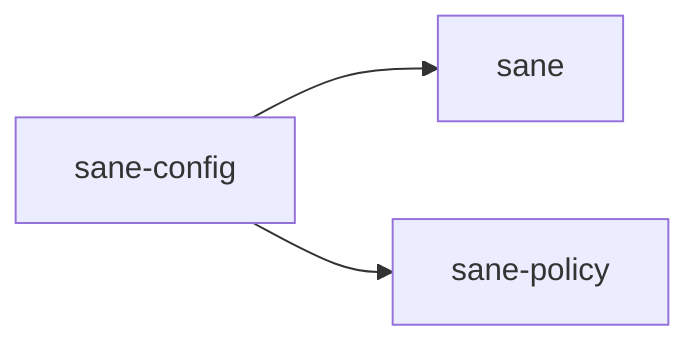

# ⚖️ sane-config

Configuration schema and validation for `Sane`.

## In Plain English

This crate defines what `Sane` settings mean.

When a user changes:

- model roles
- reasoning defaults
- built-in packs
- telemetry/privacy settings

the rules for those settings live here.

## Why This Crate Exists

`Sane` has to keep configuration stable even while the UI, profiles, and install flows evolve.

If config meaning is scattered across the app, users get:

- settings that save but do not behave consistently
- profile previews that do not match applied results
- breaking changes with no clear migration path
- old config files that are harder to evolve safely as the schema changes

`sane-config` gives the project one source of truth.

## What It Owns

- local config structs
- default settings
- model and reasoning enums
- pack configuration
- privacy and telemetry choices
- serialization and validation helpers

## What It Does Not Own

- writing Codex files
- reading platform paths
- rendering the TUI
- deciding which policy should trigger at runtime

## Where It Sits

This crate should answer:

> What does this config mean?

It should not answer:

> What should the app do next?
