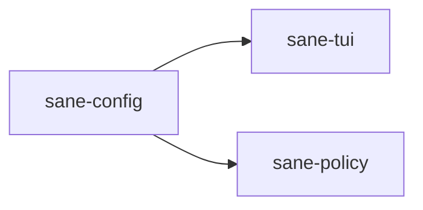

# ⚖️ sane-config

Configuration schema crate for `Sane`.

## What It Is

`sane-config` defines the configuration schema and validation rules for `Sane`.

It is the source of truth for the structure behind the TUI config screens and other config-driven behavior.

## Why It Exists

`Sane` lets users control things like:

- model-role defaults
- built-in pack toggles
- privacy / telemetry choices

Those settings need one clear, typed home.

`sane-config` exists so config meaning stays stable even if the UI or install flows change.

## Where It Fits

This crate defines the configuration schema; other crates consume it.

## What Lives Here

- local config schema
- model-role preset types
- reasoning-effort enums
- telemetry/privacy config
- built-in pack config
- validation rules
- config serialization helpers

## Real Examples

This is where `Sane` defines:

- which models are currently valid choices in the TUI
- what `coordinator`, `sidecar`, and `verifier` mean in config
- how `xhigh` is represented and validated
- which packs are enabled locally by default

## What Does Not Belong Here

- applying config to Codex files
- platform/path discovery
- TUI rendering
- orchestration behavior itself

This crate should answer: “what does this config mean?”
It should not answer: “what should we do with it right now?”
