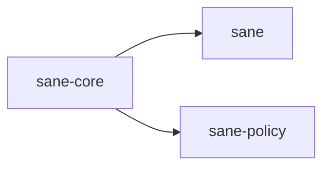

# ⚖️ sane-core

Shared vocabulary for `Sane`.

## In Plain English

If two different parts of `Sane` need to talk about the same thing in the same way, that contract belongs here.

It is also the zero-dependency anchor for shared symbols that should stay stable across the workspace.

That includes:

- managed asset names
- status types
- result shapes
- block markers for additive file edits
- generated text that must stay consistent across surfaces

## Why This Crate Exists

Without a shared core, the TUI, policy layer, and file-management code drift fast.

Users feel that drift as:

- mismatched status labels
- inconsistent previews
- broken managed-file boundaries
- one part of the app calling something "installed" while another calls it "configured"

`sane-core` exists to stop that.

## What It Owns

- shared enums and typed result structs
- canonical managed asset identifiers
- additive managed-block markers used to safely inject or remove `Sane`-managed sections in user files
- reusable generated guidance snippets

## What It Does Not Own

- filesystem access
- path discovery
- config parsing
- TUI rendering
- policy decisions

## Where It Sits

This crate should stay boring, stable, and reusable.
