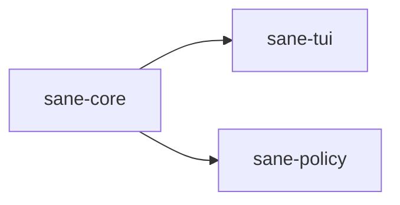

# ⚖️ sane-core

Shared foundation crate for `Sane`.

## What It Is

`sane-core` is a foundational crate containing the shared components and contracts used across the `Sane` workspace.

If two parts of the product must talk about the same managed asset, status, marker, or generated content in the same way, that contract belongs here.

## Why It Exists

`Sane` manages a mix of:

- local operational state
- user-level Codex assets
- TUI/backend actions
- generated guidance content

Without a common core, those components can drift quickly.

`sane-core` exists to stop that drift.

## Where It Fits

This crate does not run the product by itself.
It gives the rest of the workspace a shared language.

## What Lives Here

- shared names and markers
- managed block markers for additive file edits
- generated templates for managed skills and overlays
- typed backend operation results
- typed inventory/status items
- shared status enums

## Real Examples

This is where `Sane` keeps things like:

- the canonical names of managed assets such as `sane-router`
- begin/end markers for managed `AGENTS.md` blocks
- shared renderable result types used by both backend operations and the TUI
- generated guidance text for pack-aware and model-aware exports

## What Does Not Belong Here

- filesystem writes
- path discovery
- TUI screens
- config parsing
- adaptive-policy logic

If code is not reused across multiple surfaces, it probably belongs somewhere else.
