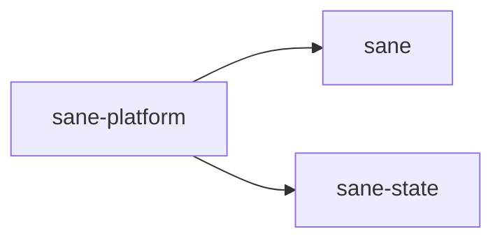

# ⚖️ sane-platform

Filesystem and platform discovery for `Sane`.

## In Plain English

This crate tells `Sane` where things live.

That includes:

- the project root
- the local `.sane` directory
- Codex user files
- backup paths
- telemetry paths

It is also the place for path normalization so `Sane` behaves like a good citizen on macOS, Linux, and Windows.

## Why This Crate Exists

`Sane` is meant to work on macOS, Linux, and Windows.

Users should not have to care where every file belongs.
The app should know.

Keeping that logic in one place makes the rest of the codebase safer and easier to reason about.

## What It Owns

- platform detection
- project-root discovery
- local `.sane` layout helpers
- Codex home path helpers
- backup and telemetry directory helpers
- path resolution and normalization

## What It Does Not Own

- config semantics
- TUI actions
- policy logic
- generated asset contents

## Where It Sits

This crate should answer:

> Where is it?

It should not answer:

> What should we do with it?
