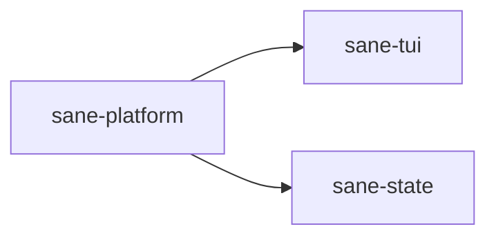

# ⚖️ sane-platform

Platform and path discovery crate for `Sane`.

## What It Is

`sane-platform` is the crate that tells `Sane` where everything lives on disk.

It abstracts platform-specific details into a unified path model for the workspace.

## Why It Exists

`Sane` is cross-platform and local-first.

That means it needs to consistently find and manage things like:

- project roots
- `.sane` runtime directories
- `~/.codex` user files
- `~/.agents/skills`
- backup and telemetry directories

Scattered path logic makes the system fragile and harder to maintain.

## Where It Fits

This crate gives the rest of the system a shared filesystem map.

## What Lives Here

- project root discovery
- host platform detection
- `.sane` layout helpers
- Codex user path discovery
- backup directory helpers
- telemetry directory helpers

## Real Examples

This crate determines paths such as:

- `.sane/config.local.toml`
- `.sane/state/current-run.json`
- `.sane/backups/codex-config/`
- `~/.codex/config.toml`
- `~/.codex/hooks.json`
- `~/.codex/agents/`
- `~/.agents/skills/`

## What Does Not Belong Here

- config semantics
- TUI actions
- adaptive-policy logic
- managed asset templates

This crate should answer: “where is it?”
It should not answer: “what does it mean?” or “how should we render it?”
