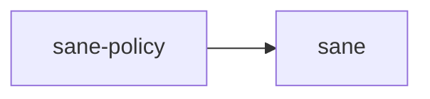

# ⚖️ sane-policy

Adaptive decision groundwork for `Sane`.

## In Plain English

One of `Sane`'s core promises is that users should not have to memorize a rigid command ritual just to get good results.

This crate is where that promise starts turning into typed behavior.

## Why This Crate Exists

`Sane` is trying to choose better defaults around:

- direct answers versus heavier workflow
- verification pressure
- subagent eligibility
- model-role usage
- long-session compaction pressure

That logic needs to be testable away from the UI and file system.

## What It Owns

- policy input types
- actionable requirement outputs
- pure evaluation logic for when stronger verification, a heavier workflow, or subagent use should apply
- role-plan recommendations

## What It Does Not Own

- prompt parsing
- file I/O
- path discovery
- TUI state

## Where It Sits

This crate should stay deterministic.
If policy behavior is hard to test or explain, this layer is failing its job.
