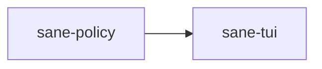

# ⚖️ sane-policy

Adaptive-policy groundwork for `Sane`.

## What It Is

`sane-policy` contains the core logic for `Sane`'s adaptive decision-making.

It is where product philosophy starts becoming typed behavior.

## Why It Exists

One of `Sane`’s core ideas is:

- no rigid user-facing modes
- no command ritual required
- adapt process to the work

That needs a logic layer that can be tested independently from UI, files, and Codex plumbing.

## Where It Fits

Today it is still groundwork.
Later it becomes a more important part of how `Sane` chooses obligations and role usage.

## What Lives Here

- typed policy inputs
- typed obligation outputs
- pure evaluation rules
- role-plan recommendation for coordinator / sidecar / verifier

## Real Examples

This crate answers questions like:

- should a trivial question stay direct?
- should a debug task trigger more verification?
- should a complex task be eligible for sidecars?
- should a long run trigger compaction pressure?

## What Does Not Belong Here

- prompt parsing
- file I/O
- TUI state
- platform logic

This crate should stay deterministic and isolated so policy behavior is easy to test and reason about.
