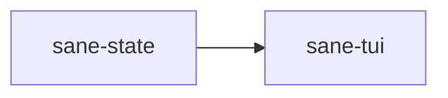

# ⚖️ sane-state

Operational state crate for `Sane`.

## What It Is

`sane-state` defines the thin local records `Sane` maintains for a project so it can inspect, repair, and continue work cleanly.

This is operational state, not a full persistent runtime environment.

## Why It Exists

`Sane` needs persistent local state to stay useful across longer runs:

- what happened
- what was touched
- what the latest summary is
- what can be resumed or repaired

That state should be structured, compact, and easy to inspect.

## Where It Fits

The TUI and backend flows use this crate to read and write thin local state files.

## What Lives Here

- run snapshots
- summaries
- event records
- append-only log helpers
- state file read/write helpers

## Real Examples

This crate owns the types behind files such as:

- `current-run.json`
- `summary.json`
- `events.jsonl`

## What Does Not Belong Here

- product config
- path discovery
- Codex asset installation
- rich long-term memory systems

If the state stops being thin and operational, it is probably growing in the wrong direction.
