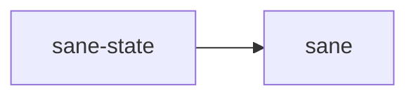

# ⚖️ sane-state

Project-local operational state for `Sane`.

## In Plain English

`Sane` keeps a small amount of structured local state so it can inspect what happened, recover cleanly, and keep long sessions from turning into guesswork.

This crate defines that state.
Think of it as the black-box recorder for the current project, not a general-purpose database.

## Why This Crate Exists

`Sane` needs more than a one-shot installer.

It needs enough local state to answer questions like:

- what did `Sane` change?
- what was the latest summary?
- what events happened recently?
- what can be repaired or resumed?

The goal is a thin, inspectable layer, not a giant hidden runtime.

## What It Owns

- current run snapshots
- summaries
- event, decision, and artifact records
- JSON and JSONL read/write helpers

Today that mainly means files like:

- `.sane/state/current-run.json`
- `.sane/state/summary.json`
- `.sane/state/events.jsonl`
- `.sane/state/decisions.jsonl`
- `.sane/state/artifacts.jsonl`
- `.sane/BRIEF.md`

## What It Does Not Own

- user preferences
- global user state
- platform discovery
- Codex config application
- long-term memory or retrieval systems

## Where It Sits

If this crate ever starts feeling like a separate product, it has grown too far.
