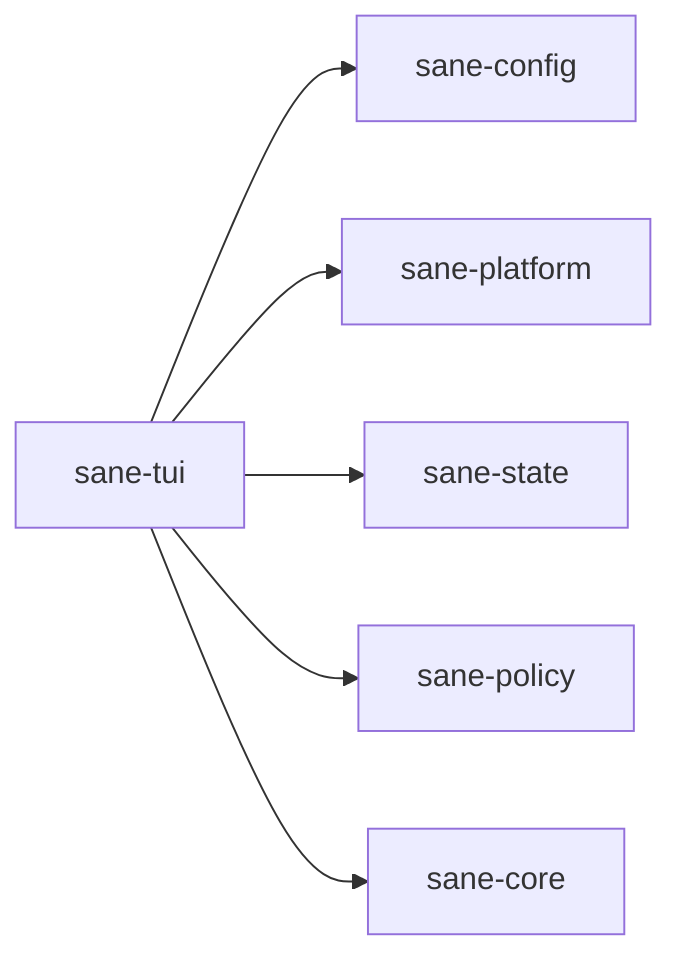

# ⚖️ sane

User-facing installer and configuration crate for `Sane`.

## What It Is

This crate is the primary entry point and interface for the product.

It owns the no-args TUI and the thin backend action layer that powers setup, inspection, export, and repair flows.

## Why It Exists

`Sane` is supposed to feel helpful without becoming another command ritual.

That means users need a clear place to:

- inspect what `Sane` is managing
- configure defaults
- preview changes safely
- apply, restore, export, and uninstall managed assets

This crate is that surface.

## Where It Fits

It integrates lower-level crates into one user-facing flow.

## What Lives Here

- no-args TUI entrypoint
- config editor
- pack editor
- privacy/telemetry screen
- status and doctor views
- preview/apply/backup/restore flows
- export/uninstall flows
- confirmation UX for risky actions
- backend/dev escape-hatch verbs

## Real Examples

This crate is responsible for actions such as:

- editing model-role defaults
- previewing Codex config profiles
- exporting managed user skills
- warning when exports become stale
- showing grouped local-vs-Codex inventory

## What Does Not Belong Here

- config schema definitions
- platform/path discovery
- pure policy logic
- cross-cutting shared types/templates

This crate should be the user-facing surface, not the place where every core rule gets invented.
