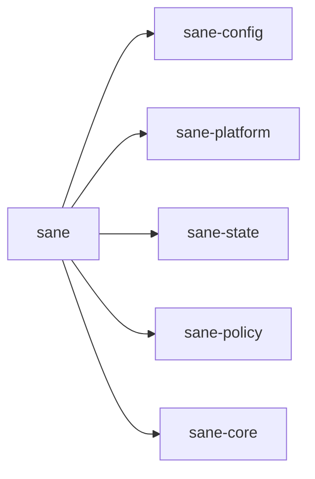

# ⚖️ sane-tui

The user-facing app surface for `Sane`.

## In Plain English

This crate is the thing users actually open.

It owns the TUI and the action layer behind flows like:

- install
- configure
- inspect
- preview
- apply
- back up
- restore
- uninstall
- doctor

It is the orchestrator that wires stable rules and config to the real world of files, paths, state, and user actions.

This is also the crate that actually installs, previews, applies, repairs, and removes:

- the `sane-router` skill
- optional pack skills
- managed `AGENTS.md` guidance
- managed hooks
- managed custom agents
- Codex profile changes
- local `.sane` runtime files

## Why This Crate Exists

`Sane` is supposed to feel like a helpful control surface, not another workflow tax.

This crate is where that promise becomes real.

It brings together the lower-level crates and turns them into a product someone can actually use.

## What It Owns

- the no-args TUI entry point
- settings and pack editing
- status and system-health diagnostics
- profile preview/apply flows
- backup and restore flows
- uninstall flows
- confirmation UX for risky actions

## What It Does Not Own

- the config schema itself
- platform/path rules
- shared core contracts
- pure policy evaluation

## Where It Sits

If a user says, "What does `Sane` actually do for me?", this crate should be the clearest answer.
